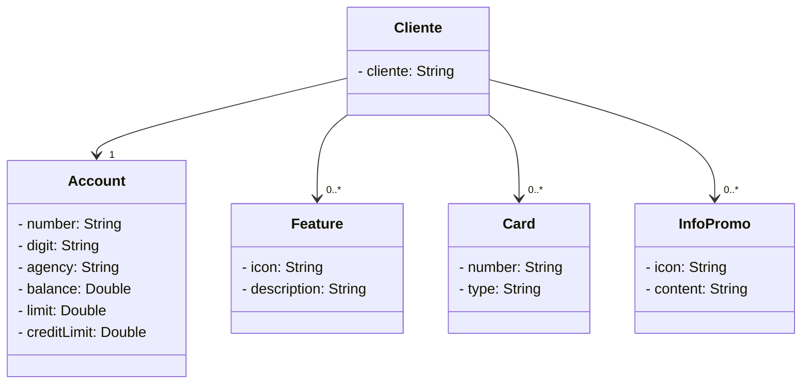

# Santander Bootcamp 2023 - Backend Java #
## Publicando Sua API REST na Nuvem Usando Spring Boot 3, Java 17 e Railway ##

Projeto com base no conteudo da [DIO](https://web.dio.me) de uma simples aplicação baseada em uma aplicação bancaria.

Diagrama de dominios
